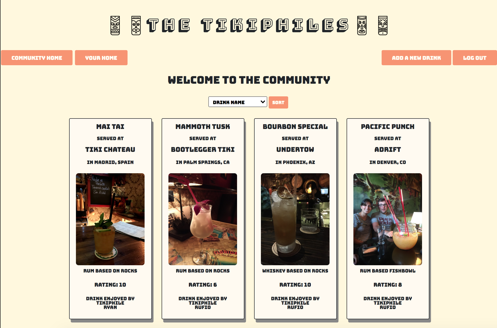

# The Tikiphiles

Welcome to the Tikiphiles. A place to record and rate all your tiki drink experiences.

## Installation & Use

1. Clone this repo
2. Run `bundle install`
3. Run `rake db:migrate` to create database (if you'd like to see the app preloaded with drinks and other users, run `rake db:seed`)
4. Run `shotgun` and navigate to `localhost:9393` in your browser
5. Cheers!

## Contributing

This project is intended to be a safe, welcoming space for collaboration, and contributors are expected to adhere to the [Contributor Covenant](http://contributor-covenant.org) code of conduct.

## License

This project is licensed under the MIT License - see [LICENSE](https://github.com/Waffles4Ransom/the_tikiphiles/blob/master/LICENSE) for details
